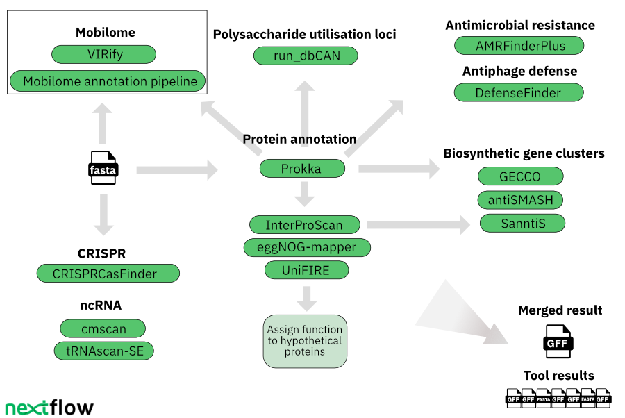

[](https://www.nextflow.io/)
[](https://www.docker.com/)
[](https://sylabs.io/docs/)

# mettannotator


- [ Introduction ](#intro)
- [ Workflow and tools](#wf)
- [ Installation and dependencies ](#install)
- [ Usage ](#usage)
- [ Test ](#test)
- [ Outputs ](#out)
- [ Citation ](#cite)

<a name="intro"></a>
## Introduction
**mettannotator** is a bioinformatics pipeline that generates an exhaustive annotation of prokaryotic genomes using existing tools. The output is a GFF file that integrates the results of all pipeline components. Results of each individual tool are also provided.

<a name="wf"></a>
## Workflow and tools

<br />
<br />

The workflow uses the following tools and databases:


| Tool/Database                                                                                    | Version           | Purpose                                                                                                          |
|--------------------------------------------------------------------------------------------------|-------------------|------------------------------------------------------------------------------------------------------------------|
| [Prokka](https://github.com/tseemann/prokka)                                                     | 1.14.6            | CDS calling and functional annotation                                                                            |
| [InterProScan](https://www.ebi.ac.uk/interpro/about/interproscan/)                               | 5.62-94.0         | Protein annotation (InterPro, Pfam)                                                                              |                                                                                                 |                   |                                                                                                                        |
| [eggNOG-mapper](https://github.com/eggnogdb/eggnog-mapper)                                       | 2.1.11            | Protein annotation (eggNOG, KEGG, COG, GO-terms)                                                                 |
| [eggNOG DB](http://eggnog6.embl.de/download/)                                                    | 5.0.2             | Database for eggNOG-mapper                                                                                       |
| [UniFIRE](https://gitlab.ebi.ac.uk/uniprot-public/unifire)                                       | 2023.4            | Protein annotation                                                                                               |
| [AMRFinderPlus](https://github.com/ncbi/amr)                                                     | 3.11.4            | Antimicrobial resistance gene annotation; virulence factors, biocide, heat, acid, and metal resistance gene annotation |
| [AMRFinderPlus DB](https://ftp.ncbi.nlm.nih.gov/pathogen/Antimicrobial_resistance/)              | 3.11 2023-02-23.1 | Database for AMRFinderPlus                                                                                       |
| [DefenseFinder](https://github.com/mdmparis/defense-finder)                                      | 1.2.0             | Annotation of anti-phage systems                                                                                 |
| [DefenseFinder models](https://github.com/mdmparis/defense-finder-models)                        | 1.2.3             | Database for DefenseFinder                                                                                       |
| [GECCO](https://github.com/zellerlab/GECCO)                                                      | 0.9.8             | Biosynthetic gene cluster annotation                                                                             |
| [antiSMASH](https://antismash.secondarymetabolites.org/#!/download)                              | 7.1.0             | Biosynthetic gene cluster annotation                                                                             |
| [SanntiS](https://github.com/Finn-Lab/SanntiS)                                                   | 0.9.3.4           | Biosynthetic gene cluster annotation                                                                             |
| [run_dbCAN](https://github.com/linnabrown/run_dbcan)                                             | 4.1.2             | PUL prediction                                                                                                   |
| [dbCAN DB](https://bcb.unl.edu/dbCAN2/download/Databases/)                                        | V12               | Database for run_dbCAN                                                                                           |
| [CRISPRCasFinder](https://github.com/dcouvin/CRISPRCasFinder)                                    | 4.3.2             | Annotation of CRISPR arrays                                                                                      |
| [cmscan](http://eddylab.org/infernal/)                                                           | 1.1.5             | ncRNA predictions                                                                                                |
| [Rfam](https://rfam.org/)                                                                        | 14.9              | Identification of SSU/LSU rRNA and other ncRNAs                                                                  |
| [tRNAscan-SE](https://github.com/UCSC-LoweLab/tRNAscan-SE)                                       | 2.0.9             | tRNA predictions                                                                                                 |
| [VIRify](https://github.com/EBI-Metagenomics/emg-viral-pipeline)                                 | 2.0.0             | Viral sequence annotation (runs separately)                                                                      |
| [Mobilome annotation pipeline](https://github.com/EBI-Metagenomics/mobilome-annotation-pipeline) | 2.0               | Mobilome annotation (runs separately)                                                                            |


<a name="install"></a>
## Installation and dependencies

This workflow is built using [Nextflow](https://www.nextflow.io/). It uses Singularity containers making installation simple and results highly reproducible.

- Install [Nextflow version >=21.10](https://www.nextflow.io/docs/latest/getstarted.html#installation)
- Install [Singularity](https://github.com/apptainer/singularity/blob/master/INSTALL.md)

All necessary databases will be automatically downloaded during the execution of the workflow.


<a name="usage"></a>
## Usage

### Input file
First, prepare an input file in the CSV format that looks as follows:

`assemblies_sheet.csv`:

```csv
prefix,assembly,taxid
BU_ATCC8492VPI0062,/path/to/BU_ATCC8492VPI0062_NT5002.fa,820
EC_ASM584v2,/path/to/GCF_000005845.2.fna,562
...
```
Here,
`prefix` is the prefix and the locus tag that will be assigned to output files, contigs and proteins during the annotation process

`assembly` is the path to where the assembly file in FASTA format is located

`taxid` is the NCBI taxid (if the species-level taxid is not known, a taxid for a higher taxonomic level can be used)

### Command

Running the tool with the `--help` option will pull the repository and display the help message:
```angular2html
nextflow run ebi-metagenomics/mettannotator/main.nf --help
N E X T F L O W  ~  version 23.04.3
Launching `mettannotator/main.nf` [disturbed_davinci] DSL2 - revision: f2a0e51af6


------------------------------------------------------
  ebi-metagenomics/mettannotator v1.0dev
------------------------------------------------------
Typical pipeline command:

  nextflow run ebi-metagenomics/mettannotator --input assemblies_sheet.csv -profile docker

Input/output options
  --input                            [string]  Path to comma-separated file containing information about the assemblies with the prefix to be used.
  --outdir                           [string]  The output directory where the results will be saved. You have to use absolute paths to storage on Cloud
                                               infrastructure.
  --email                            [string]  Email address for completion summary.
  --multiqc_title                    [string]  MultiQC report title. Printed as page header, used for filename if not otherwise specified.

Reference databases
  --dbs                              [string]  Folder for the tools' reference databases used by the pipeline for downloading.
  --interproscan_db                  [string]  The InterProScan reference database, ftp://ftp.ebi.ac.uk/pub/software/unix/iprscan/
  --interproscan_db_version          [string]  The InterProScan reference database version. [default: 5.62-94.0]
  --interpro_entry_list              [string]  TSV file listing basic InterPro entry information - the accessions, types and names,
                                               ftp://ftp.ebi.ac.uk/pub/databases/interpro/releases/94.0/entry.list
  --interpro_entry_list_version      [string]  InterPro entry list version [default: 94]
  --eggnog_db                        [string]  The EggNOG reference database folder,
                                               https://github.com/eggnogdb/eggnog-mapper/wiki/eggNOG-mapper-v2.1.5-to-v2.1.12#requirements
  --eggnog_db_version                [string]  The EggNOG reference database version. [default: 5.0.2]
  --rfam_ncrna_models                [string]  Rfam ncRNA models, ftp://ftp.ebi.ac.uk/pub/databases/metagenomics/genomes-pipeline/ncrna/
  --rfam_ncrna_models_rfam_version   [string]  Rfam release version where the models come from. [default: 14.9]
  --amrfinder_plus_db                [string]  AMRFinderPlus reference database,
                                               https://ftp.ncbi.nlm.nih.gov/pathogen/Antimicrobial_resistance/AMRFinderPlus/database/. Go to the following
                                               documentation for the db setup https://github.com/ncbi/amr/wiki/Upgrading#database-updates.
  --amrfinder_plus_db_version        [string]  The AMRFinderPlus reference database version. [default: 2023-02-23.1]
  --defense_finder_db                [string]  Defense Finder reference models, https://github.com/mdmparis/defense-finder#updating-defensefinder. The
                                               Microbiome Informatics team provides a pre-indexed version of the models for version 1.2.3 on this ftp location:
                                               ftp://ftp.ebi.ac.uk/pub/databases/metagenomics/pipelines/tools-reference-dbs/defense-finder/defense-finder-models_1.2.3.tar.gz.
  --defense_finder_db_version        [string]  The Defense Finder models version. [default: 1.2.3]
  --antismash_db                     [string]  antiSMASH reference database, go to this documentation to do the database setup
                                               https://docs.antismash.secondarymetabolites.org/install/#installing-the-latest-antismash-release.
  --antismash_db_version             [string]  The antiSMASH reference database version. [default: 7.1.0]
  --dbcan_db                         [string]  dbCAN indexed reference database, please go to the documentation for the setup
                                               https://dbcan.readthedocs.io/en/latest/. The Microbiome Informatics team provides a pre-indexed version of the
                                               database for version 4.0 on this ftp location:
                                               ftp://ftp.ebi.ac.uk/pub/databases/metagenomics/pipelines/tools-reference-dbs/dbcan/dbcan_4.0.tar.gz
  --dbcan_db_version                 [string]  The dbCAN reference database version. [default: 4.1.3_V12]

Generic options
  --multiqc_methods_description      [string]  Custom MultiQC yaml file containing HTML including a methods description.

 !! Hiding 17 params, use --validationShowHiddenParams to show them !!
------------------------------------------------------
If you use ebi-metagenomics/mettannotator for your analysis please cite:

* The nf-core framework
  https://doi.org/10.1038/s41587-020-0439-x

* Software dependencies
  https://github.com/ebi-metagenomics/mettannotator/blob/master/CITATIONS.md
------------------------------------------------------

```
Now, you can run the pipeline using:

```bash
nextflow run ebi-metagenomics/mettannotator \
   -profile <docker/singularity/...> \
   --input assemblies_sheet.csv \
   --outdir <OUTDIR>
```

> **Warning:**
> Please provide pipeline parameters via the CLI or Nextflow `-params-file` option. Custom config files including those
> provided by the `-c` Nextflow option can be used to provide any configuration _**except for parameters**_;
> see [docs](https://nf-co.re/usage/configuration#custom-configuration-files).

<a name="test"></a>
## Test
To run the pipeline using  a test dataset, execute the following command:
```bash
nextflow run ebi-metagenomics/mettannotator \
   -profile <docker/singularity/...> \
   --input ebi-metagenomics/mettannotator/tests/test.csv \
   --outdir <OUTDIR>
```

<a name="out"></a>
## Outputs


## Credits

ebi-metagenomics/mettannotator was originally written by the Microbiome Informatics Team at [EMBL-EBI](https://www.ebi.ac.uk/about/teams/microbiome-informatics/)

## Contributions and Support

If you would like to contribute to this pipeline, please see the [contributing guidelines](.github/CONTRIBUTING.md).

## Citations

An extensive list of references for the tools used by the pipeline can be found in the [`CITATIONS.md`](CITATIONS.md) file.

This pipeline uses code developed and maintained by the [nf-core](https://nf-co.re) community, reused here under the [MIT license](https://github.com/nf-core/tools/blob/master/LICENSE).

> **The nf-core framework for community-curated bioinformatics pipelines.**
>
> Philip Ewels, Alexander Peltzer, Sven Fillinger, Harshil Patel, Johannes Alneberg, Andreas Wilm, Maxime Ulysse Garcia, Paolo Di Tommaso & Sven Nahnsen.
>
> _Nat Biotechnol._ 2020 Feb 13. doi: [10.1038/s41587-020-0439-x](https://dx.doi.org/10.1038/s41587-020-0439-x).
