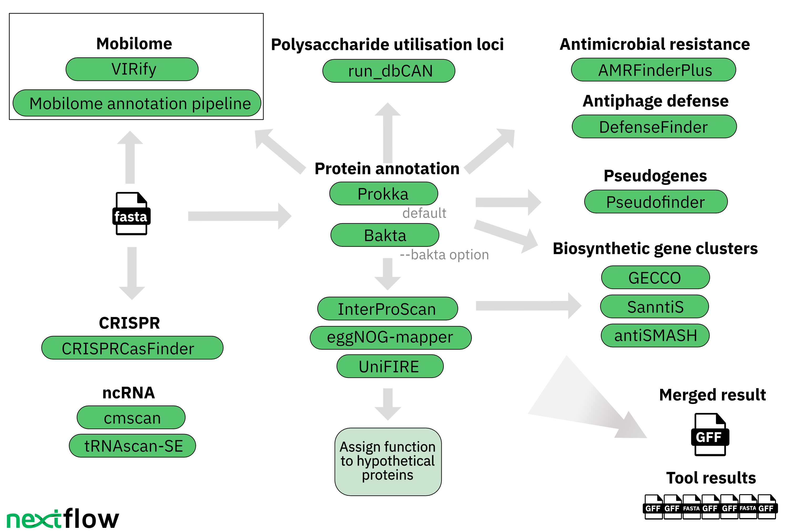

[](https://www.nextflow.io/)
[](https://www.docker.com/)
[](https://sylabs.io/docs/)

# mettannotator


- [ Introduction ](#intro)
- [ Workflow and tools](#wf)
- [ Installation and dependencies ](#install)
   - [Reference databases](#reference-databases)
- [ Usage ](#usage)
- [ Test ](#test)
- [ Outputs ](#out)
- [ Mobilome annotation ](#mobilome)
- [ Credits ](#credit)
- [ Contributions and Support ](#contribute)
- [ Citation ](#cite)

<a name="intro"></a>
## Introduction
**mettannotator** is a bioinformatics pipeline that generates an exhaustive annotation of prokaryotic genomes using existing tools. The output is a GFF file that integrates the results of all pipeline components. Results of each individual tool are also provided.

<a name="wf"></a>
## Workflow and tools

<br />
<br />

The workflow uses the following tools and databases:

| Tool/Database                                                                                    | Version           | Purpose                                                                                                          |
|--------------------------------------------------------------------------------------------------|-------------------|------------------------------------------------------------------------------------------------------------------|
| [Prokka](https://github.com/tseemann/prokka)                                                     | 1.14.6            | CDS calling and functional annotation                                                                            |
| [InterProScan](https://www.ebi.ac.uk/interpro/about/interproscan/)                               | 5.62-94.0         | Protein annotation (InterPro, Pfam)                                                                              |                                                                                                 |                   |                                                                                                                        |
| [eggNOG-mapper](https://github.com/eggnogdb/eggnog-mapper)                                       | 2.1.11            | Protein annotation (eggNOG, KEGG, COG, GO-terms)                                                                 |
| [eggNOG DB](http://eggnog6.embl.de/download/)                                                    | 5.0.2             | Database for eggNOG-mapper                                                                                       |
| [UniFIRE](https://gitlab.ebi.ac.uk/uniprot-public/unifire)                                       | 2023.4            | Protein annotation                                                                                               |
| [AMRFinderPlus](https://github.com/ncbi/amr)                                                     | 3.11.4            | Antimicrobial resistance gene annotation; virulence factors, biocide, heat, acid, and metal resistance gene annotation |
| [AMRFinderPlus DB](https://ftp.ncbi.nlm.nih.gov/pathogen/Antimicrobial_resistance/)              | 3.11 2023-02-23.1 | Database for AMRFinderPlus                                                                                       |
| [DefenseFinder](https://github.com/mdmparis/defense-finder)                                      | 1.2.0             | Annotation of anti-phage systems                                                                                 |
| [DefenseFinder models](https://github.com/mdmparis/defense-finder-models)                        | 1.2.3             | Database for DefenseFinder                                                                                       |
| [GECCO](https://github.com/zellerlab/GECCO)                                                      | 0.9.8             | Biosynthetic gene cluster annotation                                                                             |
| [antiSMASH](https://antismash.secondarymetabolites.org/#!/download)                              | 7.1.0             | Biosynthetic gene cluster annotation                                                                             |
| [SanntiS](https://github.com/Finn-Lab/SanntiS)                                                   | 0.9.3.4           | Biosynthetic gene cluster annotation                                                                             |
| [run_dbCAN](https://github.com/linnabrown/run_dbcan)                                             | 4.1.2             | PUL prediction                                                                                                   |
| [dbCAN DB](https://bcb.unl.edu/dbCAN2/download/Databases/)                                        | V12               | Database for run_dbCAN                                                                                           |
| [CRISPRCasFinder](https://github.com/dcouvin/CRISPRCasFinder)                                    | 4.3.2             | Annotation of CRISPR arrays                                                                                      |
| [cmscan](http://eddylab.org/infernal/)                                                           | 1.1.5             | ncRNA predictions                                                                                                |
| [Rfam](https://rfam.org/)                                                                        | 14.9              | Identification of SSU/LSU rRNA and other ncRNAs                                                                  |
| [tRNAscan-SE](https://github.com/UCSC-LoweLab/tRNAscan-SE)                                       | 2.0.9             | tRNA predictions                                                                                                 |
| [VIRify](https://github.com/EBI-Metagenomics/emg-viral-pipeline)                                 | 2.0.0             | Viral sequence annotation (runs separately)                                                                      |
| [Mobilome annotation pipeline](https://github.com/EBI-Metagenomics/mobilome-annotation-pipeline) | 2.0               | Mobilome annotation (runs separately)                                                                            |


<a name="install"></a>
## Installation and dependencies

This workflow is built using [Nextflow](https://www.nextflow.io/). It uses containers (Docker or Singularity) making installation simple and results highly reproducible.

- Install [Nextflow version >=21.10](https://www.nextflow.io/docs/latest/getstarted.html#installation)
- Install [Singularity](https://github.com/apptainer/singularity/blob/master/INSTALL.md)
- Install [Docker](https://docs.docker.com/engine/install/)

Although it's possible to run the pipeline on a personal computer, due to the compute requirements, we encourage users to run it on HPC clusters. Any HPC scheduler supported by [Nextflow](https://www.nextflow.io/) is compatible; however, our team primarily uses [Slurm](https://slurm.schedmd.com/) and [IBM LSF](https://www.ibm.com/docs/en/spectrum-lsf) for the EBI HPC cluster, so those are the profiles we ship with the pipeline.

<a name="reference-databases"></a>
### Reference databases

The pipeline needs reference databases in order to work, they take roughly 110G.

Path             | Size
-----------------|------
amrfinder        | 217M
antismash        | 9.4G
dbcan            | 7.5G
defense_finder   | 242M
eggnog           | 48G
interproscan     | 45G
interproscan_entry_list  | 2.6M |
rfam_models      | 637M
total            | 110G

`mettannotator` has an automated mechanism to download the databases using the `--dbs <db_path>` flag. When this flag is provided, the pipeline inspects the folder to verify if the required databases are already present. If any of the databases are missing, the pipeline will automatically download them.

Users can also provide individual paths to each reference database and its version if needed. For detailed instructions, please refer to the Reference databases section in the `--help` of the pipeline.

It's important to note that users are not allowed to mix the `--dbs` flag with individual database paths and versions; they are mutually exclusive. We recommend users to run the pipeline with the `--dbs` flag for the first time in an appropriate path and to avoid downloading the individual databases separately.


<a name="usage"></a>
## Usage

### Input file
First, prepare an input file in the CSV format that looks as follows:

`assemblies_sheet.csv`:

```csv
prefix,assembly,taxid
BU_ATCC8492VPI0062,/path/to/BU_ATCC8492VPI0062_NT5002.fa,820
EC_ASM584v2,/path/to/GCF_000005845.2.fna,562
...
```
Here,
`prefix` is the prefix and the locus tag that will be assigned to output files and proteins during the annotation process;

`assembly` is the path to where the assembly file in FASTA format is located;

`taxid` is the NCBI taxid (if the species-level taxid is not known, a taxid for a higher taxonomic level can be used).

### Command

Running the tool with the `--help` option will pull the repository and display the help message:
```angular2html
nextflow run ebi-metagenomics/mettannotator/main.nf --help
N E X T F L O W  ~  version 23.04.3
Launching `mettannotator/main.nf` [disturbed_davinci] DSL2 - revision: f2a0e51af6


------------------------------------------------------
  ebi-metagenomics/mettannotator <version>
------------------------------------------------------
Typical pipeline command:

  nextflow run ebi-metagenomics/mettannotator --input assemblies_sheet.csv -profile docker

Input/output options
  --input                            [string]  Path to comma-separated file containing information about the assemblies with the prefix to be used.
  --outdir                           [string]  The output directory where the results will be saved. You have to use absolute paths to storage on Cloud
                                               infrastructure.
  --email                            [string]  Email address for completion summary.
  --multiqc_title                    [string]  MultiQC report title. Printed as page header, used for filename if not otherwise specified.

Reference databases
  --dbs                              [string]  Folder for the tools' reference databases used by the pipeline for downloading.
  --interproscan_db                  [string]  The InterProScan reference database, ftp://ftp.ebi.ac.uk/pub/software/unix/iprscan/
  --interproscan_db_version          [string]  The InterProScan reference database version. [default: 5.62-94.0]
  --interpro_entry_list              [string]  TSV file listing basic InterPro entry information - the accessions, types and names,
                                               ftp://ftp.ebi.ac.uk/pub/databases/interpro/releases/94.0/entry.list
  --interpro_entry_list_version      [string]  InterPro entry list version [default: 94]
  --eggnog_db                        [string]  The EggNOG reference database folder,
                                               https://github.com/eggnogdb/eggnog-mapper/wiki/eggNOG-mapper-v2.1.5-to-v2.1.12#requirements
  --eggnog_db_version                [string]  The EggNOG reference database version. [default: 5.0.2]
  --rfam_ncrna_models                [string]  Rfam ncRNA models, ftp://ftp.ebi.ac.uk/pub/databases/metagenomics/genomes-pipeline/ncrna/
  --rfam_ncrna_models_rfam_version   [string]  Rfam release version where the models come from. [default: 14.9]
  --amrfinder_plus_db                [string]  AMRFinderPlus reference database,
                                               https://ftp.ncbi.nlm.nih.gov/pathogen/Antimicrobial_resistance/AMRFinderPlus/database/. Go to the following
                                               documentation for the db setup https://github.com/ncbi/amr/wiki/Upgrading#database-updates.
  --amrfinder_plus_db_version        [string]  The AMRFinderPlus reference database version. [default: 2023-02-23.1]
  --defense_finder_db                [string]  Defense Finder reference models, https://github.com/mdmparis/defense-finder#updating-defensefinder. The
                                               Microbiome Informatics team provides a pre-indexed version of the models for version 1.2.3 on this ftp location:
                                               ftp://ftp.ebi.ac.uk/pub/databases/metagenomics/pipelines/tools-reference-dbs/defense-finder/defense-finder-models_1.2.3.tar.gz.
  --defense_finder_db_version        [string]  The Defense Finder models version. [default: 1.2.3]
  --antismash_db                     [string]  antiSMASH reference database, go to this documentation to do the database setup
                                               https://docs.antismash.secondarymetabolites.org/install/#installing-the-latest-antismash-release.
  --antismash_db_version             [string]  The antiSMASH reference database version. [default: 7.1.0]
  --dbcan_db                         [string]  dbCAN indexed reference database, please go to the documentation for the setup
                                               https://dbcan.readthedocs.io/en/latest/. The Microbiome Informatics team provides a pre-indexed version of the
                                               database for version 4.0 on this ftp location:
                                               ftp://ftp.ebi.ac.uk/pub/databases/metagenomics/pipelines/tools-reference-dbs/dbcan/dbcan_4.0.tar.gz
  --dbcan_db_version                 [string]  The dbCAN reference database version. [default: 4.1.3_V12]

Generic options
  --multiqc_methods_description      [string]  Custom MultiQC yaml file containing HTML including a methods description.

 !! Hiding 17 params, use --validationShowHiddenParams to show them !!
------------------------------------------------------
If you use ebi-metagenomics/mettannotator for your analysis please cite:

* The nf-core framework
  https://doi.org/10.1038/s41587-020-0439-x

* Software dependencies
  https://github.com/ebi-metagenomics/mettannotator/blob/master/CITATIONS.md
------------------------------------------------------

```
Now, you can run the pipeline using:

```bash
nextflow run ebi-metagenomics/mettannotator \
   -profile <docker/singularity/...> \
   --input assemblies_sheet.csv \
   --outdir <OUTDIR> \
   --dbs <PATH/TO/WHERE/DBS/WILL/BE/SAVED>
```

> **Warning:**
> Please provide pipeline parameters via the CLI or Nextflow `-params-file` option. Custom config files including those
> provided by the `-c` Nextflow option can be used to provide any configuration _**except for parameters**_;
> see [docs](https://nf-co.re/usage/configuration#custom-configuration-files).

<a name="test"></a>
## Test
To run the pipeline using a test dataset, execute the following command:
```bash
wget https://raw.githubusercontent.com/EBI-Metagenomics/mettannotator/master/tests/test.csv

nextflow run ebi-metagenomics/mettannotator \
   -profile <docker/singularity/...> \
   --input test.csv \
   --outdir <OUTDIR> \
   --dbs <PATH/TO/WHERE/DBS/WILL/BE/SAVED>
```

<a name="out"></a>
## Outputs

The output folder structure will look as follows:
```
└─<PREFIX>
   ├─antimicrobial_resistance
   │  └─amrfinder_plus
   ├─antiphage_defense
   │  └─defense_finder
   ├─biosynthetic_gene_clusters
   │  ├─antismash
   │  ├─gecco
   │  └─sanntis
   ├─functional_annotation
   │  ├─dbcan
   │  ├─eggnog_mapper
   │  ├─interproscan
   │  ├─merged_gff
   │  ├─prokka
   │  └─unifire
   ├─mobilome
   │  └─crisprcas_finder
   ├─quast
   │  └─<PREFIX>
   │      ├─basic_stats
   │      └─icarus_viewers
   ├─rnas
   │  ├─ncrna
   │  └─trna
   ├─multiqc
   │  ├─multiqc_data
   │  └─multiqc_plots
   │      ├─pdf
   │      ├─png
   │      └─svg
   ├─pipeline_info
   │  ├─software_versions.yml
   │  ├─execution_report_<timestamp>.txt
   │  ├─execution_report_<timestamp>.html
   │  ├─execution_timeline_<timestamp>.txt
   │  ├─execution_timeline_<timestamp>.html
   │  ├─execution_trace_<timestamp>.txt
   │  ├─execution_trace_<timestamp>.html
   │  └─pipeline_dag_<timestamp>.html

```

### Merged GFF

The two main output files for each genome are located in `<OUTDIR>/<PREFIX>/functional_annotation/merged_gff/`:

- `<PREFIX>_annotations.gff`: annotations produced by all tools merged into a single file

- `<PREFIX>_annotations_with_descriptions.gff`: a version of the GFF file above that includes descriptions of all InterPro terms to make the annotations human-readable.

Both files include the genome sequence in the FASTA format at the bottom of the file.

#### Data sources
Below is an explanation of how each field in column 3 and 9 of the final GFF file is populated. In most cases, information is taken as is from the reporting tool's output.

| Feature (column 3)    | Attribute Name (column 9)                                               | Reporting Tool  | Description                                                                                                                                                                                                 |
|-----------------------|-------------------------------------------------------------------------|-----------------|-------------------------------------------------------------------------------------------------------------------------------------------------------------------------------------------------------------|
| ncRNA                 | all*                                                                    | cmscan + Rfam   | ncRNA annotation (excluding tRNA)                                                                                                                                                                           |
| tRNA                  | all*                                                                    | tRNAscan-SE     | tRNA annotation                                                                                                                                                                                             |
| LeftFLANK, RightFLANK | all*                                                                    | CRISPRCasFinder | CRISPR array flanking sequence                                                                                                                                                                              |
| CRISPRdr              | all*                                                                    | CRISPRCasFinder | Direct repeat region of a CRISPR array                                                                                                                                                                      |
| CRISPRspacer          | all*                                                                    | CRISPRCasFinder | CRISPR spacer                                                                                                                                                                                               |
| CDS                   | `ID`, `eC_number`, `Name`, `db_xref`, `gene`, `inference`, `locus_tag`  | Prokka          | Protein annotation                                                                                                                                                                                          |
| CDS                   | `product`                                                               | mettannotator   | Product assigned as described in [ Determining the product ](#product)                                                                                                                                      |
| CDS                   | `product_source`                                                        | mettannotator   | Tool that reported the product chosen by mettannotator                                                                                                                                                      |
| CDS                   | `eggNOG`                                                                | eggNOG-mapper   | Seed ortholog from eggNOG                                                                                                                                                                                   |
| CDS                   | `cog`                                                                   | eggNOG-mapper   | COG category                                                                                                                                                                                                |
| CDS                   | `kegg`                                                                  | eggNOG-mapper   | KEGG orthology term                                                                                                                                                                                         |
| CDS                   | `Ontology_term`                                                         | eggNOG-mapper   | GO associations                                                                                                                                                                                             |
| CDS                   | `pfam`                                                                  | InterProScan    | Pfam accessions                                                                                                                                                                                             |
| CDS                   | `interpro`                                                              | InterProScan    | InterPro accessions. In `<PREFIX>_annotations_with_descriptions.gff` each accession is followed by its description and entry type: Domain [D], Family [F], Homologous Superfamily [H], Repeat [R], Site [S] |
| CDS                   | `nearest_MiBIG`                                                         | SanntiS         | MiBIG accession of the nearest BGC to the cluster in the MIBIG space                                                                                                                                        |
| CDS                   | `nearest_MiBIG_class`                                                   | SanntiS         | BGC class of nearest_MiBIG                                                                                                                                                                                  |
| CDS                   | `gecco_bgc_type`                                                        | GECCO           | BGC type                                                                                                                                                                                                    |
| CDS                   | `antismash_bgc_function`                                                | antiSMASH       | BGC function                                                                                                                                                                                                |
| CDS                   | `amrfinderplus_gene_symbol`                                             | AMRFinderPlus   | Gene symbol according to AMRFinderPlus                                                                                                                                                                      |
| CDS                   | `amrfinderplus_sequence_name`                                           | AMRFinderPlus   | Product description                                                                                                                                                                                         |
| CDS                   | `amrfinderplus_scope`                                                   | AMRFinderPlus   | AMRFinderPlus database (core or plus)                                                                                                                                                                       |
| CDS                   | `element_type`, `element_subtype`                                       | AMRFinderPlus   | Functional category                                                                                                                                                                                         |
| CDS                   | `drug_class`, `drug_subclass`                                           | AMRFinderPlus   | Class and subclass of drugs that this gene is known to contribute to resistance of                                                                                                                          |
| CDS                   | `dbcan_prot_type`                                                       | run_dbCAN       | Predicted protein function: transporter (TC), transcription factor (TF), signal transduction protein (STP), CAZyme                                                                                          |
| CDS                   | `dbcan_prot_family`                                                     | run_dbCAN       | Predicted protein family                                                                                                                                                                                    |
| CDS                   | `substrate_dbcan-pul`                                                   | run_dbCAN       | Substrate predicted by dbCAN-PUL search                                                                                                                                                                     |
| CDS                   | `substrate_dbcan-sub`                                                   | run_dbCAN       | Substrate predicted by dbCAN-subfam                                                                                                                                                                         |
| CDS                   | `defense_finder_type`, `defense_finder_subtype`                         | DefenseFinder   | Type and subtype of the anti-phage system found                                                                                                                                                             |
| CDS                   | `uf_prot_rec_fullname`, `uf_prot_rec_shortname`, `uf_prot_rec_ecnumber` | UniFIRE         | Protein recommended full name, short name and EC number according to UniFIRE                                                                                                                                |
| CDS                   | `uf_prot_alt_fullname`, `uf_prot_alt_shortname`, `uf_prot_alt_ecnumber` | UniFIRE         | Protein alternative full name, short name and EC number according to UniFIRE                                                                                                                                |
| CDS                   | `uf_chebi`                                                              | UniFIRE         | ChEBI identifiers                                                                                                                                                                                           |
| CDS                   | `uf_ontology_term`                                                      | UniFIRE         | GO associations                                                                                                                                                                                             |
| CDS                   | `uf_keyword`                                                            | UniFIRE         | UniFIRE keywords                                                                                                                                                                                            |
| CDS                   | `uf_gene_name`, `uf_gene_name_synonym`                                  | UniFIRE         | Gene name and gene name synonym according to UniFIRE                                                                                                                                                        |
| CDS                   | `uf_pirsr_cofactor`                                                     | UniFIRE         | Cofactor names from PIRSR                                                                                                                                                                                   |

*all attributes in column 9 are populated by the tool
<br>
<br>


<a name="product"></a>
#### Determining the product
The following logic is used by `mettannotator` to fill out the `product` field in the 9th column of the GFF:


### Contents of the tool output folders
The output folders of each individual tool contain select output files of the third-party tools used by `mettannotator`. For file descriptions, please refer to the tool documentation.

Note: if the pipeline completed without errors but some of the tool-specific output folders are empty, those particular tools did not generate any annotations to output.

<a name="mobilome"></a>
## Mobilome annotation

The mobilome annotation workflow is not currently integrated into `mettannotator`. However, the outputs produced by `mettannotator` can be used to run [VIRify](https://github.com/EBI-Metagenomics/emg-viral-pipeline) and the [mobilome annotation pipeline](https://github.com/EBI-Metagenomics/mobilome-annotation-pipeline).

These post-processing steps will be better integrated in the next release.

<a name="credit"></a>
## Credits

ebi-metagenomics/mettannotator was originally written by the Microbiome Informatics Team at [EMBL-EBI](https://www.ebi.ac.uk/about/teams/microbiome-informatics/)

<a name="contribute"></a>
## Contributions and Support

If you would like to contribute to this pipeline, please see the [contributing guidelines](.github/CONTRIBUTING.md).

<a name="cite"></a>
## Citations

An extensive list of references for the tools used by the pipeline can be found in the [`CITATIONS.md`](CITATIONS.md) file.

This pipeline uses code developed and maintained by the [nf-core](https://nf-co.re) community, reused here under the [MIT license](https://github.com/nf-core/tools/blob/master/LICENSE).

> **The nf-core framework for community-curated bioinformatics pipelines.**
>
> Philip Ewels, Alexander Peltzer, Sven Fillinger, Harshil Patel, Johannes Alneberg, Andreas Wilm, Maxime Ulysse Garcia, Paolo Di Tommaso & Sven Nahnsen.
>
> _Nat Biotechnol._ 2020 Feb 13. doi: [10.1038/s41587-020-0439-x](https://dx.doi.org/10.1038/s41587-020-0439-x).
